# KubeVirt UI

A multi-tenant web UI for [KubeVirt](https://kubevirt.io) virtual machines, in
the spirit of vCenter or Proxmox. Administrators invite users by link; users log
in with a password and TOTP and only ever see the namespaces they were invited
to. Every action runs with the user's own Kubernetes permissions.

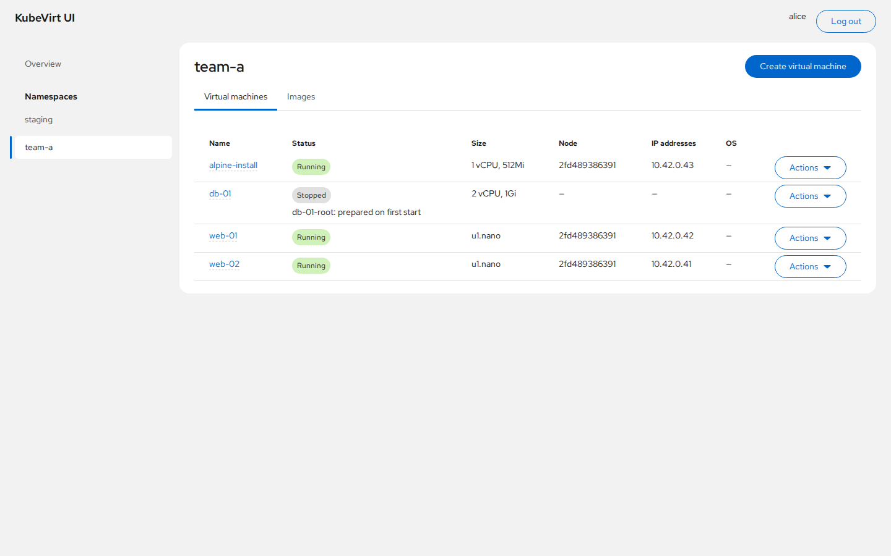

## Features

- **Invite-only onboarding.** Single-use, expiring invite links. Accounts are
  local, with mandatory TOTP and one-time recovery codes.
- **Namespace isolation.** Users can belong to several namespaces, each with
  one of three roles: `viewer`, `operator` or `owner`.
- **Live VM list and details.** Status, node, IPs and disk import progress
  update in the browser as they change (server-sent events backed by
  Kubernetes watches).
- **Power actions.** Start, stop, restart, pause and unpause.
- **Consoles in the browser.** VNC (noVNC) and serial (xterm.js), proxied over
  websockets.
- **Create VMs.** Size from a cluster or namespace instance type, or a custom
  CPU and memory size, with an optional OS preference. The boot disk can be a
  registry image, a download URL, an uploaded disk image, an ephemeral
  container disk or a blank disk, with an optional ISO as CD-ROM. Access is via
  SSH keys or custom cloud-init.
- **Image library.** Upload ISOs and disk images from the browser into CDI.
- **Administration.** Invites, users, namespace memberships and an audit log.

## Screenshots

### Virtual machines

| Power actions | VM details |
| --- | --- |
| 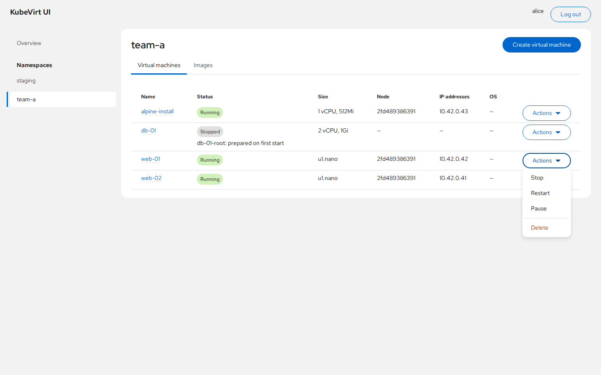 | 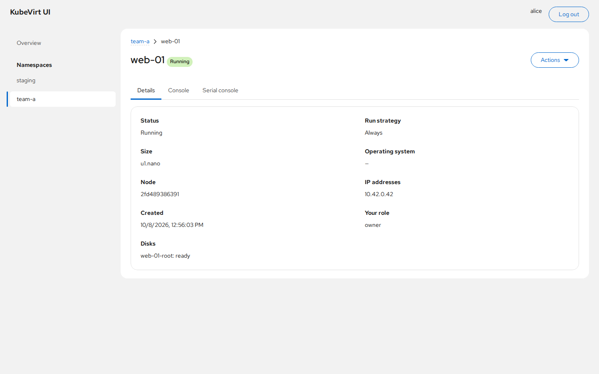 |

### Consoles

| VNC console | Serial console |
| --- | --- |
| 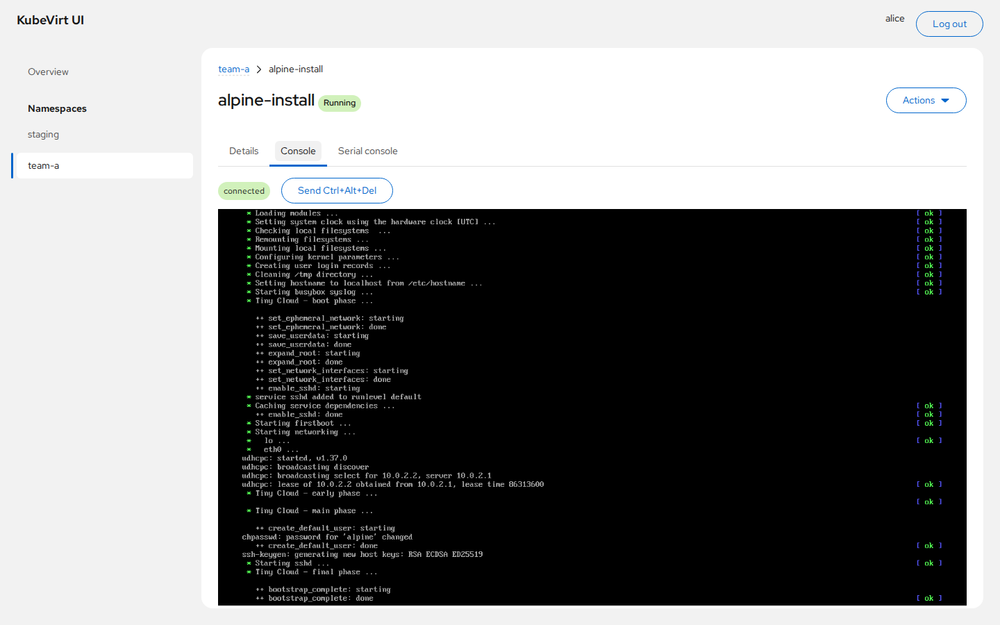 | 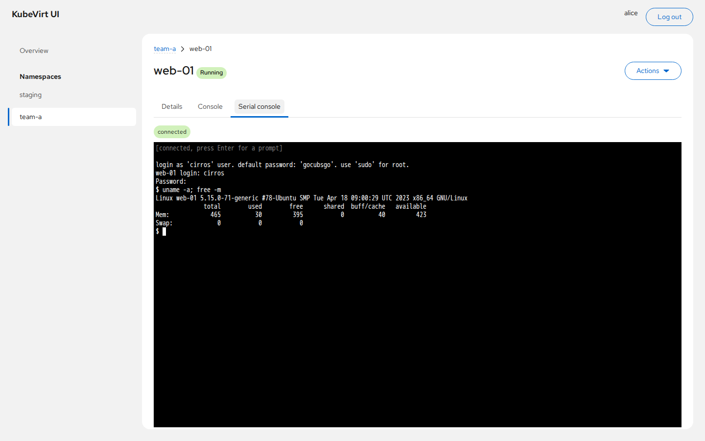 |

### Creating a VM

| Instance type | Blank disk + ISO install |
| --- | --- |
| 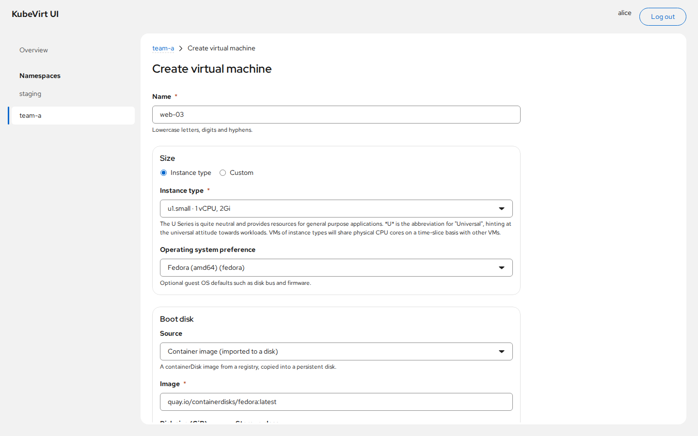 | 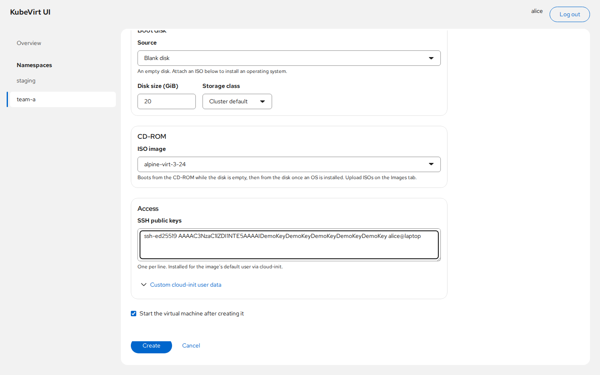 |

### Images

| Image library | Upload |
| --- | --- |
| 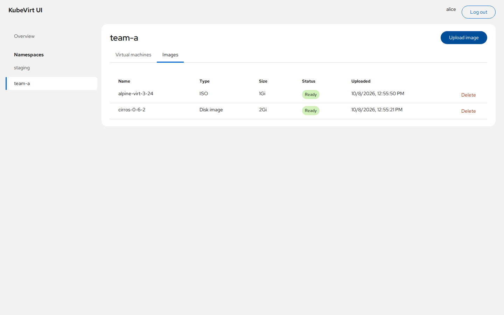 | 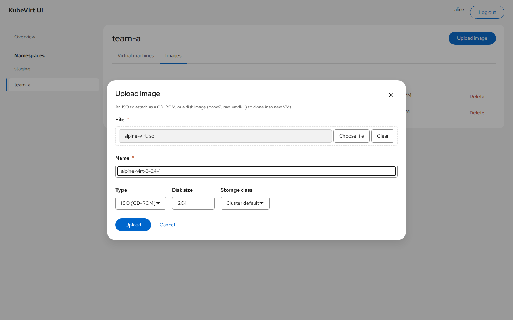 |

### Onboarding and administration

| Login | Invite: TOTP enrolment |
| --- | --- |
| 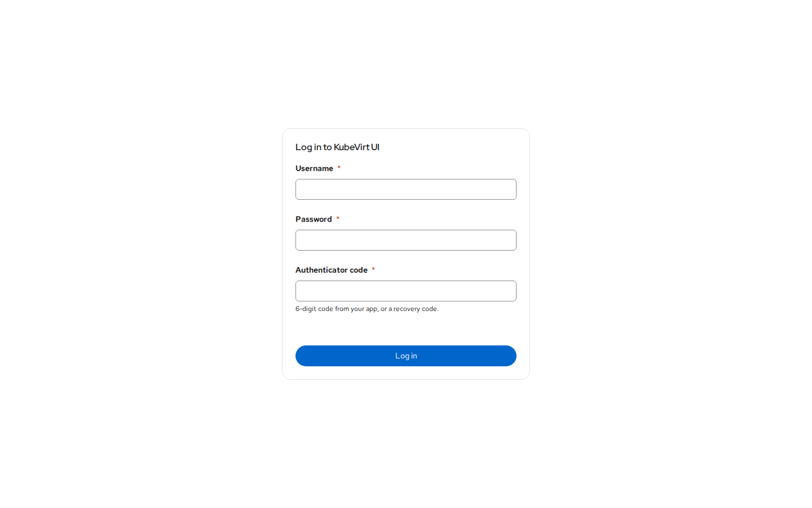 | 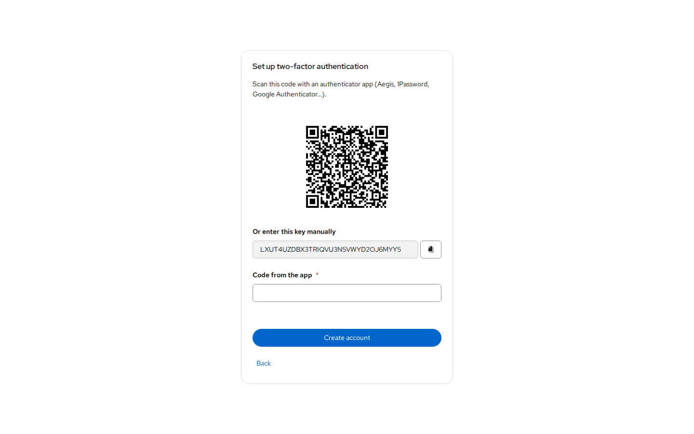 |

| Invites | Users and memberships |
| --- | --- |
| 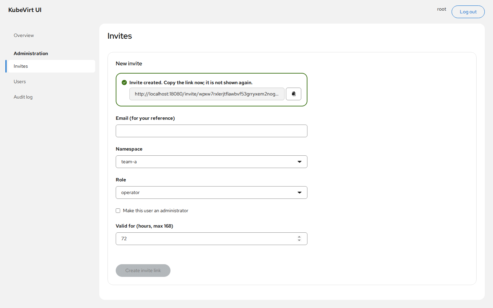 | 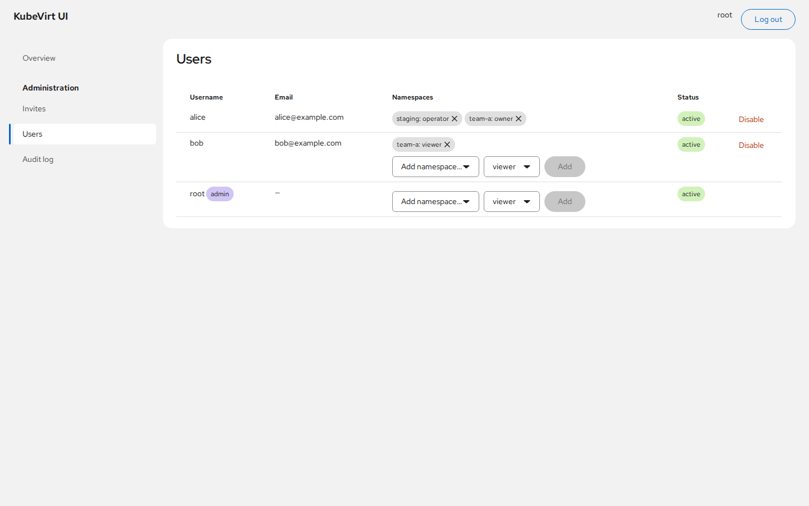 |

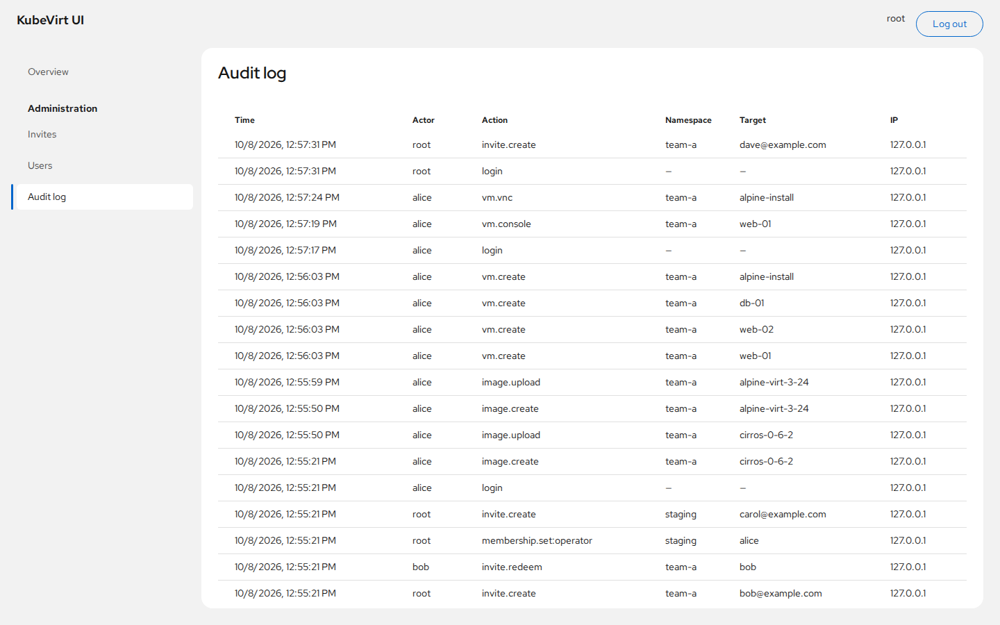

## How access works

- Each membership (user, namespace, role) becomes a ServiceAccount `kvui-u<id>`
  in that namespace, bound to the ClusterRole `kubevirt-ui-<role>`.
- API calls for a user use a 10-minute token for that ServiceAccount, so the
  Kubernetes apiserver enforces permissions. The backend never decides
  authorization itself.
- Roles (see `deploy/helm/kubevirt-ui/templates/_helpers.tpl`):
  - `viewer`: read only.
  - `operator`: adds power actions and the consoles.
  - `owner`: adds creating and deleting VMs, disks and images.
- The roles are deliberately narrower than Kubernetes' built-in `edit`: they
  grant no access to pods, secrets or exec.
- Only namespaces labelled `kubevirt-ui.io/tenant=true` can be used.
- **Revocation:**
  - Removing a membership deletes the ServiceAccount, which revokes its tokens.
  - Open consoles close within 30 seconds.
  - Live-update streams reconnect, and recheck access, every 5 minutes.

## Layout

```
backend/    Go API (cmd/kvui, internal/{api,auth,store,tenant,vm,image})
frontend/   React + PatternFly SPA
deploy/     Helm chart and tenant namespace example
docs/       screenshots
Dockerfile  builds both into one distroless image (published by .github/workflows)
```

## Cluster prerequisites

- **KubeVirt and CDI** installed; nodes with VT-x/AMD-V (`/dev/kvm`).
- **A CSI storage class.** RWX block storage (e.g. Rook-Ceph RBD) is needed
  for live migration.
- **A CDI StorageProfile for every storage class users may pick.** CDI fills
  these in for provisioners it knows (Ceph RBD, Longhorn, ...). For others,
  imports stay Pending with "no accessMode specified in StorageProfile". Fix it
  with:

  ```sh
  kubectl patch storageprofile <class> --type merge \
    -p '{"spec":{"claimPropertySets":[{"accessModes":["ReadWriteOnce"],"volumeMode":"Filesystem"}]}}'
  ```

- **Kubernetes 1.30+** for the chart's ValidatingAdmissionPolicy, which
  confines the backend's cluster-wide RBAC to tenant namespaces. On older
  clusters set `admissionPolicy.enabled=false`.
- **Ingress that allows large uploads.** Image uploads go through ingress as
  one large request; see the ingress-nginx annotations in `values.yaml`.
  With `ingress.enabled`, set `trustedProxies` to the ingress controller's
  pod CIDR so login rate limits and the audit log see real client addresses.
- **A CNI that enforces NetworkPolicy** (e.g. Cilium). Talos' default Flannel
  does not, so the policies in `deploy/examples/tenant-namespace.yaml` would be
  silently ignored. Those policies also matter for security: they stop the CDI
  importer, which fetches user-supplied URLs, from reaching internal services.

## Install

Images for `linux/amd64` and `linux/arm64` are published to
`ghcr.io/samfaunt/kube-virt-ui` by GitHub Actions
(`.github/workflows/image.yml`):

- `:main` and `:sha-<commit>` for every push to `main`.
- `:X.Y.Z`, `:X.Y` and `:latest` for every `vX.Y.Z` tag.

The chart defaults to the image tagged with its `appVersion`.

```sh
helm install kvui deploy/helm/kubevirt-ui -n kubevirt-ui --create-namespace \
  --set publicURL=https://vms.example.com
kubectl -n kubevirt-ui exec deploy/kubevirt-ui -- /app/kvui admin-invite
kubectl apply -f deploy/examples/tenant-namespace.yaml   # edit first
```

Open the printed link to create the first administrator. Back up the generated
`<release>-key` Secret: it encrypts the TOTP secrets, and losing it locks
every user out of two-factor login.

## Develop

```sh
# backend (uses your current kubeconfig)
cd backend
export KVUI_PUBLIC_URL=http://localhost:5173 KVUI_INSECURE_COOKIES=true \
       KVUI_SECRET_KEY=$(openssl rand -base64 32)   # keep this stable across restarts
go run ./cmd/kvui admin-invite
go run ./cmd/kvui
go test ./...

# frontend (proxies /api to :8080)
cd frontend && npm install && npm run dev
```

Outside the cluster, image uploads also need a route to CDI's upload proxy,
e.g. `kubectl -n cdi port-forward svc/cdi-uploadproxy 18443:443` with
`KVUI_CDI_UPLOAD_URL=https://127.0.0.1:18443` and
`KVUI_CDI_UPLOAD_SERVER_NAME=cdi-uploadproxy.cdi.svc`.
